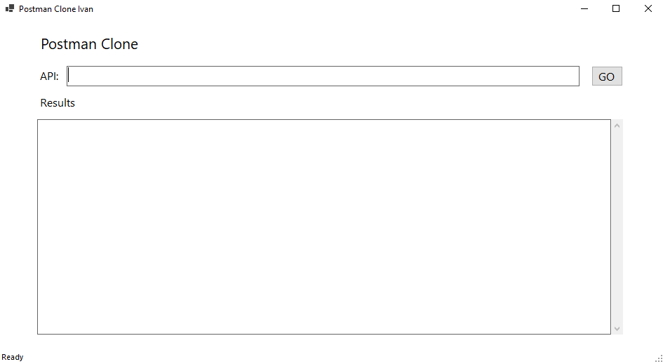
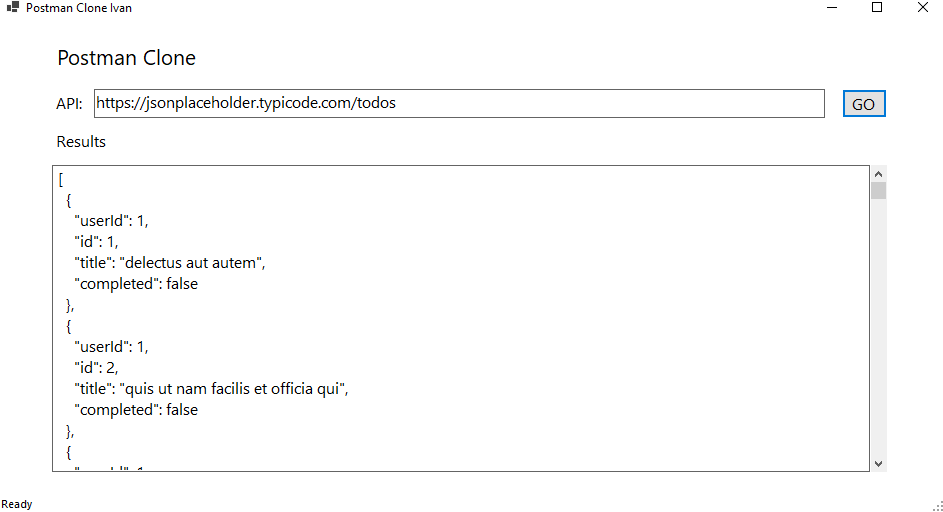

# PostmanClone

Postman Clone provides a user-friendly interface for making GET requests to APIs and viewing the responses in formated JSON. Ideal for developers and testers, this tool simplifies API interaction and debugging, helping you efficiently validate and troubleshoot your API calls.

## Technologies Used
* C#
* .Net 9
* WinForms
* HttpClient

## Using The App
1. Download the executable file from the release section.
2. When the application lanches, it should look like this:

3. Fill in your API URL and hit Go:

## Upcomming Changes
* Adding POST,PUT,PATCH and DELETE functionallity
* Adding API headers
* Handling API authentication
* Adding Dependency Injection
* Adding Logging
* Create a web-based user interface for the application
